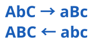

<div align="center">
  
  <h1>Swap Case</h1>
  <p><a href="/docs/README-EN.md">English</a></p>
  <p><a href="https://github.com/BarudakRosul/swap-case/issues/new?assignees=&labels=bug&projects=&template=bug_report.yml">Report Bug</a> · <a href="https://github.com/BarudakRosul/swap-case/issues/new?assignees=&labels=enhancement&projects=&template=feature_request.yml">Request Feature</a></p>
  <p>
    <a href="https://github.com/BarudakRosul/swap-case/actions/workflows/test.yml"></a>
    <a href="https://npmjs.com/package/@barudakrosul/swap-case"></a>
    <a href="/LICENSE"></a>
    <a href="https://npmjs.com/package/@barudakrosul/swap-case"></a>
    <a href="https://github.com/BarudakRosul/swap-case/stargazers"></a>
    <a href="https://github.com/BarudakRosul/swap-case/network/members"></a>
    <a href="https://github.com/BarudakRosul/swap-case/issues"></a>
  </p>
  <a href="https://techforpalestine.org/learn-more"></a>
</div>

## Table of Contents

1. [Introduction](#introduction)
2. [Features](#features)
3. [Installation](#installation)
4. [Usage](#usage)
5. [Contribution](#contribution)
6. [License](#license)
7. [Acknowledge](#acknowledge)
8. [Donate](#donate)
9. [Changelog](#changelog)

## Introduction

Swap Case is a JavaScript extension that converts each letter of a string to its opposite. Lowercase letters are converted to uppercase and vice versa. It is made as similar as possible to the `swapcase()` function in Python.

## Features

Swap Case offers the following features:

- Converts each letter in a string to its opposite.
- Can be integrated into TypeScript code.

## Installation

To install Swap Case locally, follow these installation steps:

```shell
npm install @barudakrosul/swap-case
```

## Usage

To start using Swap Case, import the module first:

**1\. CommonJS**
```javascript
require("@barudakrosul/swap-case");
```

**2\. ESM (ECMAScript Modules)**
```javascript
import "@barudakrosul/swap-case";
```

**3\. TypeScript**
```typescript
import "@barudakrosul/swap-case";
```

Example of usage:

```javascript
let text = "Hello World!";
console.log(text.toSwapCase());

// Result:
// "hELLO wORLD!"
```

## Contribution

Contributions to Swap Case are greatly appreciated! Whether reporting bugs, suggesting new features, or contributing to code improvements.

## License

Swap Case is licensed under the CC0-1.0 License - see the [LICENSE](/LICENSE) file for details.

## Acknowledge

Swap Case appreciates the support and contributions of the following individuals and open source projects:

- [@Achixz](https://github.com/Achixz) - Lead developer and creator of the application.
- Open source community - For valuable contributions to the tools and libraries used in this project.

## Donate

We really appreciate your support to continue developing this project. If you find this project useful, you can support us with a donation:

[](https://ko-fi.com/barudakrosul)
[](https://trakteer.id/barudakrosul)

Every donation, no matter the amount, means a lot to us. Thank you for your support! ❤️

## Changelog

Keep up with the latest changes and updates of Swap Case by referring to [Changelog](https://github.com/BarudakRosul/swap-case/releases).

Thank you for choosing Swap Case! We aim to provide an easy solution to convert strings into their reverse case.

[](https://techforpalestine.org/learn-more)